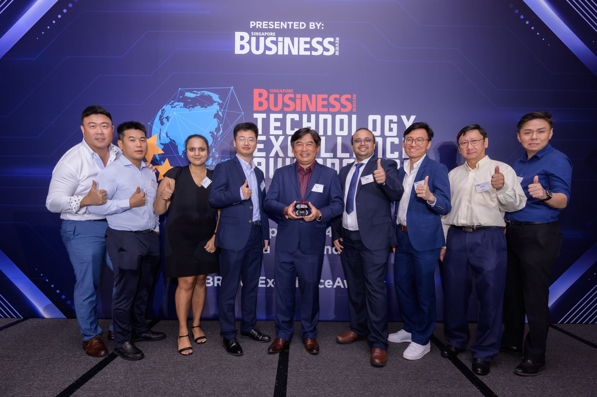
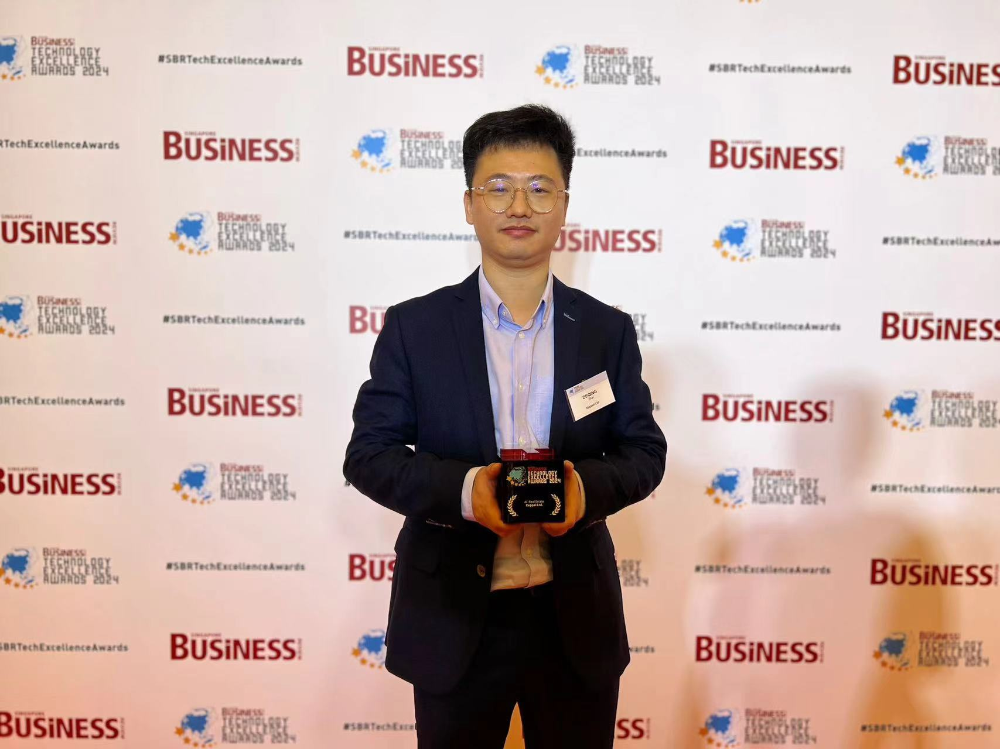
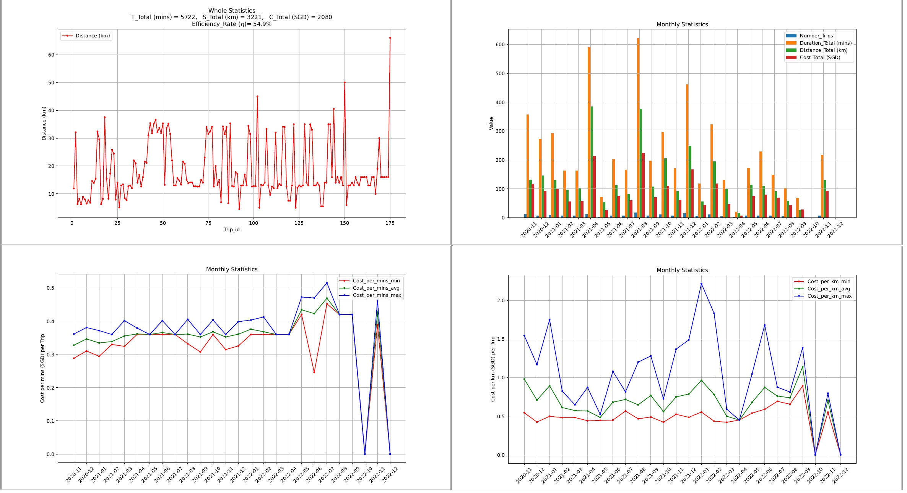
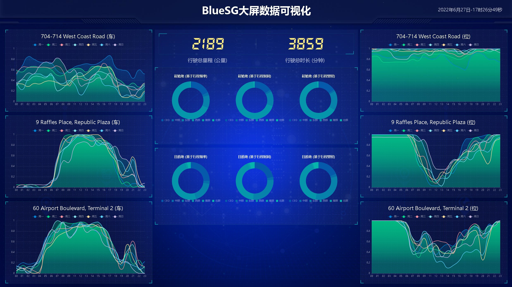
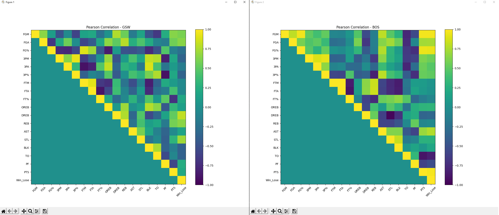

-------------------------------------------------------------------
# About Me

    Good day. Welcome to my homepage.

    I graduated both bachelor and Ph.D. degrees in Electrical and Electronic Engineering from Nanyang Technological University, Singapore in the year of 2014 and 2018, respectively.

    In my bachelor study, I specialized in control systems and clean energy branches, and graduated with First Class Honour and Dean's List. Besides study, I also joined some societies, such as IEEE NTU Student Chapter and NTU Astronomy Society.

    In my Ph.D. study, I focused on machine learning and optimization algorithms in the domain of AI x IoT applications: smart buildings, such as energy efficiency and thermal comfort evaluations over centralized Air-Conditioning and Mechanical Ventilation (ACMV) systems. I also joined in societies together with research and study, such as IEEE Student, INNS Student, IEEE Industrial Electronics Society (Singapore Chapter), IEEE NTU Student Chapter and NTU Astronomy Society.

    I had been working in Department of Systems Science (SS) at Institute of High Performance Computing (IHPC) at Agency for Science, Technology and Research (A*STAR) as a research scientist from 2018 to 2021. After A*STAR, I had been working in Department of Digital & Technology and Department of Data & Digital at Keppel Ltd. as a data scientist (Exp.) and manager since 2021. The research interests focus on data analytics, machine learning and optimization algorithm development over different domains of AI x IoT, such as maritime, supply chain, logistics, industrial production line, smart buildings, market analytics, etc. 

    Besides the abovementioned, I had also been in academic societies, such as IEEE Singapore Section, IEEE Young Professionals, IEEE Industrial Electronics Society, IEEE Smart Cities Ambassadors, Elsevier and Yaseen Panels.
 
    
For more details, may also check my [LinkedIn](https://www.linkedin.com/in/deqingzhai) and [Zhihu](https://www.zhihu.com/people/peter-zhai-333/posts) for more fun articles written by myself.

-------------------------------------------------------------------

# Research Interests

## DAMO
    1) Data Analytics (Statistical analysis, Hypothesis testing, etc.)
    2) Modelling (Mathematical Physics-based, ML-based, Hybrid, etc.)
    3) Optimization (Analytical-based, Heuristic-based, etc.)

## Domains
    1) AI x IoT (e.g. Smart Cities/Buildings/Homes, etc.)
    2) Logistics/Supply Chain/Operation Research (e.g. Maritime/Land/Air, etc.)
    3) Healthcare (e.g. Diagnosis Classification, etc.)

-------------------------------------------------------------------

# Research Techniques

## Machine Learning
    1) Supervised Learning: Linear Regression, Logistic Regression, Neural Networks, K Nearest Neighbour, Random Forest, Gradient Boost, XGBoost.
    2) Unsupervised Learning: Multi Decomposed Gaussian Sampling, K-Means, Principal Component Analysis.
    3) Reinforcement Learning: Policy Gradient, Q-Learning.
    
## Optimization Algorithms
    1) Classical: : Particle Swarm Optimization, Genetic Algorithm, Augmented Firefly Algorithm, Monte Carlo Sampling and Simulation, Gradient Descent, Quadratic Programming, Quadratic Unconstrained Binary Optimization, Minimum Eigensolver.
    2) Quantum: Variational Quantum Eigensolver, Quantum Approximate Optimization Algorithm.

-------------------------------------------------------------------

# Research Projects - Overview
    [16] Microsoft Fabric POC: Research on Data Sciences (D&D, Keppel: 2024)
    [15] Data Centre Land Banking: Initiatives for India and Thailand (D&D, Keppel: 2024)
    [14] SUR Solutions: Smart Lighting Optimization (D&D, Keppel: 2024)
    [13] SUR Solutions: AHU and Chiller Plant Analyses & Optimizations (D&D, Keppel: 2024)
    [12] JCI Data Integration with Snowflake (D&T and KTI, Keppel: 2022-Present Ongoing)
    [11] 100-Day Leadership Challenge: Change Enabler Initiatives (D&T and CX, Keppel: 2022)
    [10] Customer 360: Retail Customer Analytics RFM-based Snowflake POC (D&T and KTI, Keppel: 2022)
    [9] Smart Buildings: Sustainable Urban Renewal (SUR) for KBT Initiatives (D&T, Keppel: 2022-Present Ongoing)
    [8] Singapore Food Agency (SFA): Food Supply Chain and System Modelling POC (IHPC, A*STAR: 2021)
    [7] Arcstone Programme: Real-time Schedule Optimization and Re-planning (C2) (IHPC, A*STAR: 2021)
    [6] Arcstone Programme: Living Simulation Model for Production Use-cases (C1) (IHPC, A*STAR: 2021)
    [5] Estmated Time to Un-Berth Prediction for Terminals in Singapore (IHPC, A*STAR: 2020-2021)
    [4] Enhancing Operation Efficiency for Tanker Shipping Operations in Singapore (IHPC, A*STAR: 2018-2020)
    [3] Energy Modelling and Simulation of NTU Campus Buildings for Future Renovations in Singapore (ERI@N, NTU: 2018)
    [2] Chilled Ceiling Air-Conditioning System for Tropical Climates (ERI@N, NTU: 2018)
    [1] Singapore NRF Competitive Research Programme (CRP): New Generation HVAC Systems – Total Energy Efficiency Solution (EEE, NTU: 2014-2018)

-------------------------------------------------------------------

# Research Projects - Details

## [16] Microsoft Fabric POC: Research on Data Sciences (D&D, Keppel: 2024)
    1) Explore and research on data sciences capability on Fabric
    2) Build, evaluate and deploy ML-based models and respective metrics
    
## [15] Data Centre Land Banking: Initiatives for India and Thailand (D&D, Keppel: 2024)
    1) Analyze global researches, reports, and data from related websites on relevant topics
    2) Develop supply-demand models for data centre in India and Thailand
    3) Develop predictive models for forecasting next few years' trending on DC sites
    
## [14] SUR Solutions: Smart Lighting Optimization (D&D, Keppel: 2024)
    1) Analyze historical usage pattern and occupancy pattern
    2) Develop smart features on lighting systems - Save about 51% energy from BAU baseline
    
## [13] SUR Solutions: AHU and Chiller Plant Analyses & Optimizations
    1) Analyze historical data from AHU and Chiller Plants
    2) Develop ML-based and physics-based models for proactive optmizations - Save about 10-30% energy from BAU baseline

## [12] JCI Data Integration with Snowflake
    1) Conduct data migration from JCI to Snowflake
    2) Conduct data analytics, ML-based modelling and optimization

## [11] 100-Day Leadership Challenge: Change Enabler Initiatives
    1) Involve in experimentation design for hypothesis testing
    2) Conduct statistical analyses to validate hypothesis and draw insightful conclusions for initiatives

## [10] Customer 360: Retail Customer Analytics RFM-based Snowflake POC
    1) Using Third-party API to request data ingestion for Snowflake platform
    2) Involve in customer 360 modelling for classifying different customers

## [9] Smart Buildings: Sustainable Urban Renewal (SUR) for KBT Initiatives
    1) Perform data analytics on KBT IoT big data
    2) Develop predictive models of energy profile and environment profile of KBT building
    3) Develop optimization algorithm for energy efficient KBT building operations
    4) Develop chiller plant optimization via data-driven heuristic algorithm
    5) Develop AI/ML-based occupancy predictive models and carbon dioxide predictive models

## [8] Singapore Food Agency (SFA): Food Supply Chain and System Modelling POC
    1) Perform data analyses on the food supply
    2) Develop predictive models of food imported
    3) Develop supply chain associative net works of food imported
    
## [6 & 7] Arcstone Programme
    1) Develop predictive modeling on cycletime of production line physics-based and distribution-based
    2) Develop predictive modeling on cycletime of production line ML-based
    3) Develop predictive modeling on cycletime of production line hybrid-based
    4) Develop scheduling and re-scheduling models of different scenarios during production
    
## [4] Quantum Computing
    1) Explore to learn quantum algorithms
    2) Explore to translate classical optimization problems into quantum compatible and solvable problems, e.g. QUBO with some toy problems
    3) Explore to develop classical-quantum hybrid algorithms for certain applicable use-cases with efficiently computational efforts
    
## [4] Maritime Supply Chain and Logistics
    1) Identify trajectory patterns of vessels
    2) Identify key locations of potential collision situational awareness
    3) Develop stay location and duration detection based on automatic identification system (AIS)
    4) Develop route identification and waypoints for global traffic trajectories
    5) Develop physics-based predictive modeling on estimated time of arrival (ETA) of vessels

## [4 & 5] Maritime Operational Research
    1) Develop predictive modeling on durations of cargo operations for vessel berthing at terminals
    2) Develop predictive modeling on expected time to unberth (ETUB) for vessel berthing at terminals
    3) Schedule and optimize on terminal/berth/vessel utilization given a desired time window and scenarios
    4) Increase operation efficiency of terminals/berths/vessels, maximize throughput over Singapore passage and port
    5) Minimize wait time and turnaround time of vessels

## [1] Thermal Comfort
    1) Develop passive approach physics modelling based on Fanger's environmental parameters
    2) Develop active approach ML modelling based on occupant's physiological parameters
    3) Develop hybrid approach ML modelling based on environmental parameters and physiological parameters

## [1 & 2 & 3] Air-Conditioning and Mechanical Ventilation Systems
    1) Develop control systems for Air-Handling Unit (AHU), Water Chiller Unit (WCHU) and Condenser
    2) Evaluate energy consumption on different operating schemes
    3) Evaluate environmental parameter effects on different operating schemes
    4) Optimize multi-objective on energy efficiency and thermal comfort for operating ACMV systems 
    
-------------------------------------------------------------------

# Publications

[[29]]() **Deqing Zhai**, Subodh Bahadure, Bryan Ong, Yeng Chai Soh, "Conserving Energy of Office Lighting by Smart Features in Singapore Buildings", 2024 IEEE International Conference on Industrial Electronics and Applications (ICIEA) @ Kristiansand, Norway, [2024].

[[28]]() **Deqing Zhai**, Subodh Bahadure, Bryan Ong, Yeng Chai Soh, "Predicting Carbon Dioxide Levels for Built Environment of Flexible and Hot-desking Offices in Different Scenarios", 2024 IEEE International Conference on Industrial Electronics and Applications (ICIEA) @ Kristiansand, Norway, [2024].

[[27]](https://ieeexplore.ieee.org/document/10311972) **Deqing Zhai**, Bryan Ong, Kamalpreet Kaur, Nick Leong, Esther Ho, Yeng Chai Soh, "Profiling Energy and Built Environment Performance of A Smart Building in Singapore: A Case Study of Multi-Periods of Covid-19 Pandemic", 2023 IEEE 49th Annual Conference of the IEEE Industrial Electronics Society (IECON) @ Singapore, [2023].

[[26]](https://ieeexplore.ieee.org/document/10241825) **Deqing Zhai**, Bryan Ong, Kamalpreet Kaur, Nick Leong, Esther Ho, Yeng Chai Soh, "Evaluating Changing Extents of Built Environment from Singapore Measures against Covid-19: A Case Study of A Smart Building", 2023 IEEE International Conference on Industrial Electronics and Applications (ICIEA) @ Ningbo, China, [2023].

[[25]](https://arxiv.org/abs/2205.07945) **Deqing Zhai**, Xiuju Fu, Xiao Feng Yin, Haiyan Xu, Wanbing Zhang and Ning Li, "Constructing Trajectory and Predicting Estimated Time of Arrival for Long Distance Travelling Vessels: A Probability Density-based Scanning Approach", arXiv > Electrical Engineering and Systems Science > Systems and Control, [2022].

[[24]](https://arxiv.org/abs/2204.03955) **Deqing Zhai**, Xiuju Fu, Haiyan Xu, Xiao Feng Yin, Wanbing Zhang and Ning Li, "Optimizing Coordinative Schedules for Tanker Terminals: An Intelligent Spatial-Temporal Big Data Driven Approach - Part 2", arXiv > Computer Science > Computational Engineering, Finance, and Science, [2022].

[[23]](https://arxiv.org/abs/2204.03899) **Deqing Zhai**, Xiuju Fu, Haiyan Xu, Xiao Feng Yin, Wanbing Zhang and Ning Li, "Optimizing Coordinative Schedules for Tanker Terminals: An Intelligent Spatial-Temporal Big Data Driven Approach - Part 1", arXiv > Computer Science > Computational Engineering, Finance, and Science, [2021].

[[22]](https://arxiv.org/abs/2204.04085) **Deqing Zhai**, Xiuju Fu, Haiyan Xu, Xiao Feng Yin and Wanbing Zhang, "Predicting Berth Stay for Tanker Terminals: A Systematic and Dynamic Approach", arXiv > Computer Science > Computational Engineering, Finance, and Science, [2021].

[[21]](https://ieeexplore.ieee.org/document/9248206) **Deqing Zhai**, Xiuju Fu, Haiyan Xu, Xiao Feng Yin, Vasundhara Jayaraman and Wanbing Zhang, "Multi-Layer Scheduling Optimization for Intelligent Mobility of Maritime Operation", 2020 IEEE International Conference on Industrial Electronics and Applications (ICIEA) @ Kristiansand, Norway, [2020].

[[20]](https://dr.ntu.edu.sg/handle/10220/48443) **Deqing Zhai**, "Modeling and optimization of ACMV systems for energy efficient smart buildings", Doctoral Thesis, Nanyang Technological University, Singapore, [2019].

[[19]](https://arxiv.org/abs/2205.00833) **Deqing Zhai** and Yeng Chai Soh, "Predicting and Optimizing for Energy Efficient ACMV Systems: Computational Intelligence Approaches", arXiv > Electrical Engineering and Systems Science > Systems and Control, [2019]. 

[[18]](https://nfas.autonomous-ship.org/wp-content/uploads/2020/09/78_icmass19.pdf) **Deqing Zhai**, Xiuju Fu, Haiyan Xu, Xiao Feng Yin, Vasundhara Jayaraman and Rick Siow Mong Goh, "Digitalisation and predictive modelling of berth stay time windows for tanker operation enhancement", International Maritime and Port Technology and Development Conference (MTEC) & International Conference on Maritime Autonomous Surface Ship (ICMASS) @ Trondheim, Norway, [2019].

[[17]](https://ieeexplore.ieee.org/document/8978867) **Deqing Zhai**, Xiuju Fu, Haiyan Xu, Xiao Feng Yin, Vasundhara Jayaraman, Wanbing Zhang and Rick Siow Mong Goh, "Optimization and Simulation on Tanker Vessels Scheduling for Efficient Terminal Operations", 2019 IEEE International Conference on Industrial Engineering & Engineering Management (IEEM) @ Macau, China, [2019].

[[16]](https://ieeexplore.ieee.org/abstract/document/8978767) Haiyan Xu, Vasundhara Jayaraman, Xiuju Fu, Nasri Bin Othman, Wanbing Zhang, Xiao Feng Yin, **Deqing Zhai** and Rick Siow Mong Goh, "Efficient Compression and Preprocessing for Facilitating Large Scale Spatiotemporal Data Mining-A Case Study based on Automatic Identification System Data", 2019 IEEE International Conference on Industrial Engineering & Engineering Management (IEEM) @ Macau, China, [2019].

[[15]](https://ieeexplore.ieee.org/document/8489214) **Deqing Zhai**, Tanaya Chaudhuri, Yeng Chai Soh, Xianhua Ou and Chaoyang Jiang, "Improvement of Energy Efficiency of Markov ACMV Systems based on PTS Information of Occupants", 2018 IEEE World Congress on Computational Intelligence (WCCI) @ Rio de Janeiro, Brazil, [2018].
    
[[14]](https://doi.org/10.1016/j.enbuild.2018.02.035) T. Chaudhuri, **Deqing Zhai**, Yeng Chai Soh, Hua Li and Lihua Xie, "Random forest based thermal comfort prediction from gender-specific physiological parameters using wearable sensing technology", Energy and Buildings, vol. 166, pp. 391–406, [2018].
    
[[13]](https://doi.org/10.1016/j.enbuild.2018.06.044) Gang Jing, Wenjian Cai, **Deqing Zhai**, Shuai Liu and Can Cui, "A model-based air balancing method of a ventilation system", Energy and Buildings, vol. 174, pp. 506-512, [2018].

[[12]](https://doi.org/10.1016/j.apenergy.2018.03.087) Xianhua Ou, Wenjian Cai, Xiongxiong He and **Deqing Zhai**, "Experimental investigations on heat and mass transfer performances of a liquid desiccant cooling and dehumidification system", Applied Energy, vol. 220, pp. 164-175, [2018].
    
[[11]](https://doi.org/10.1016/j.buildenv.2018.07.037) Gang Jing, Wenjian Cai, Haoran Chen, **Deqing Zhai**, Can Cui and Xiaohong Yin, "An air balancing method using support vector machine for a ventilation system", Building and Environment, vol. 143, pp. 487-495, [2018].

[[10]](https://ieeexplore.ieee.org/document/8489069) Tanaya Chaudhuri, **Deqing Zhai**, Yeng Chai Soh, Hua Li, Lihua Xie and Xianhua Ou, "Convolutional Neural Network and Kernel Methods for Occupant Thermal State Detection using Wearable Technology", 2018 IEEE World Congress on Computational Intelligence (WCCI) @ Rio de Janeiro, Brazil, [2018].

[[9]](https://ieeexplore.ieee.org/document/8168568) **Deqing Zhai**, Tanaya Chaudhuri and Yeng Chai Soh, "Energy efficiency improvement with k-means approach to thermal comfort for acmv systems of smart buildings", 2017 IEEE Asian Conference on Energy, Power and Transportation Electrification(ACEPT) @ Marina Bay Sands, Singapore, pp. 203-208 [2017].

[[8]](https://ieeexplore.ieee.org/document/7966028) **Deqing Zhai** and Yeng Chai Soh, "Balancing indoor thermal comfort and energy consumption of air-conditioning and mechanical ventilation systems via sparse Firefly algorithm optimization", 2017IEEE30th International Joint Conference on Neural Networks (IJCNN) @ Anchorage, Alaska, USA, pp. 1488–1494 [2017].

[[7]](https://doi.org/10.1016/j.buildenv.2017.08.032) **Deqing Zhai**, Tanaya Chaudhuri and Yeng Chai Soh, "Modeling and optimization of different sparse augmented firefly algorithms for acmv systems under two case studies", Building and Environment, vol. 125, pp. 129-142, [2017].
    
[[6]](https://doi.org/10.1016/j.enbuild.2017.05.019) **Deqing Zhai** and Yeng Chai Soh, "Balancing indoor thermal comfort and energy consumption of acmv systems via sparse swarm algorithms in optimizations", Energy and Buildings, vol.149, pp. 1–15, [2017].
    
[[5]](https://doi.org/10.1016/j.enbuild.2017.10.098) Tanaya Chaudhuri, **Deqing Zhai**, Yeng Chai Soh, Hua Li and Lihua Xie, "Thermal comfort prediction using normalized skin temperature in a uniform built environment", Energy and Buildings, vol. 159, pp. 426–440, [2017].
    
[[4]](https://doi.org/10.1016/j.enbuild.2017.12.041) Xianhua Ou, Wenjian Cai, Xiongxiong He, Xinli Wang and **Deqing Zhai**, "A dynamic modeling of liquid desiccant cooling and dehumidification system for control and optimization", Energy and Buildings, vol. 163, pp. 44–57, [2017].
    
[[3]](https://doi.org/10.1016/j.buildenv.2017.02.007) Chaoyang Jiang, Yeng Chai Soh, Hua Li, Mustafa K. Masood, Zhe Wei, Xiaoli Zhou and **Deqing Zhai**, “CFD results calibration from sparse sensor observations with a case study for indoor thermal map,” Building and Environment, vol. 117, pp. 166–177, [2017].

[[2]](https://ieeexplore.ieee.org/document/7603675) **Deqing Zhai**, Yeng Chai Soh and Wenjian Cai, "Operating points as communication bridge between energy evaluation with air temperature and velocity based on extreme learning machine (ELM) models", 2016 IEEE 11th International Conference on Industrial Electronics and Applications (ICIEA) @ Hefei, China, pp. 712–716 [2016].

[1] **Deqing Zhai** and Yeng Chai Soh, "Research on indoor air-flow measurements and predictions with different methods", 2015 International OSA Network of Students (IONS), The Optical Society @ Nanjing, China, pp. 52–56 [2015].

-------------------------------------------------------------------

# Awards:

[[7]](https://www.linkedin.com/feed/update/urn:li:activity:7200700987471192064/) Singapore Business Review Technology Excellence Awards @ AI + Real Estate Awarded [2024]

[6] IEEE Smart Cities Ambassador, IEEE Singapore Section [2021-Present]

[5] NTU Research Scholar, Nanyang Technological University, Singapore [2014-2018]

[4] NTU First-Class Honour, Nanyang Technological University, Singapore [2014]

[3] NTU Dean’s List, Nanyang Technological University, Singapore [2014]

[2] Singapore-MOE Scholar, Nanyang Technological University, Singapore [2011-2014]

[1] Third Prize of International Mathematical Olympiad, Hebei, China [2006]

-------------------------------------------------------------------

# Organizations:

[6] Yaseen Academy Committee [2021-Present]

[5] IEEE Smart Cities Committee [2020-Present]

[4] Elsevier Panel Advisor [2017-Present]

[3] IEEE Industrial Electronics Society [2017-Present]

[2] IEEE Young Professionals [2017-Present]

[1] IEEE Student Member [2017-2019], IEEE Member [2019-Present]

-------------------------------------------------------------------

# DIY Projects (Partially Presented):

[4] Analyzing Carsharing Statistics: A Utilization-based Data Analytics

[3] Analyzing BlueSG Carsharing: A Big Screen for Big Data Analytics

[2] Analyzing NBA Championship Finals 2022: GSW vs. BOS

[1] Monitoring and Analyzing Indoor Air Quality: Smart Home Systems

-------------------------------------------------------------------

Any enquiry, please feel free to contact me via e-mail at: dzhai001 [at] e.ntu.edu.sg. 

Last Updated: 2024-06-27 16:45 (SGT)
